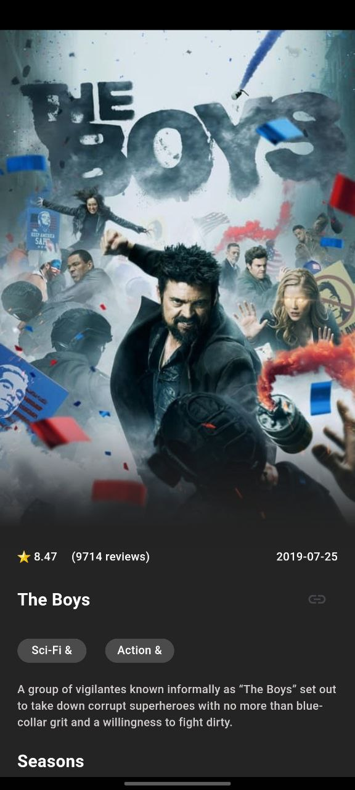

# FlutterFlicks

FlutterFlicks is a cutting-edge movie and series streaming app developed using Flutter. This app leverages the MVVM architecture, Firebase for authentication, and follows clean code principles with Cubit state management. The user interface is enriched with smooth animations, providing a delightful experience for users.

## Features

- **MVVM Architecture**: Ensures a clean separation of concerns, making the app scalable and maintainable.
- **Firebase Authentication**: Secure user authentication with Firebase.
- **Clean Code**: Adheres to clean code principles, ensuring readability, maintainability, and scalability.
- **Cubit State Management**: Efficient state management using the Cubit package.
- **Animated UI**: Smooth and engaging user interface animations.
- **Top Rated Movies and Series**: Discover the highest-rated content.
- **Popular Movies and Series**: Stay up-to-date with what's trending.
- **Upcoming Movies and Series**: Never miss out on upcoming releases.
- **Detailed Information**: Get comprehensive details, including descriptions, ratings, video trailers, crew information, and similar movies or series.
- **Search Functionality**: Easily search for any movie or series.

### Login Screen


### Signup Screen


### Movie Screen


### Movie Details


### Movie View


### Tv Screen


### Tv Details



### Tv Details


### Search Screen


## Installation

To get started with MovieMate, follow these steps:

1. **Clone the repository**:
   ```bash
   git clone https://github.com/AhmedMoanis22/MovieMate

## Technologies Used

- **Flutter**: For building the cross-platform mobile application.
- **Firebase**: For user authentication.
- **Cubit**: For state management.
- **API Integration**: For fetching movie and series data.
- **Animations**: For a smooth and engaging user experience.

## Contributing

Contributions are welcome! Please fork this repository and submit a pull request for any features, bug fixes, or enhancements.

## License

This project is licensed under the MIT License.


